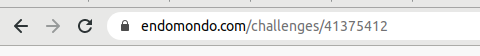
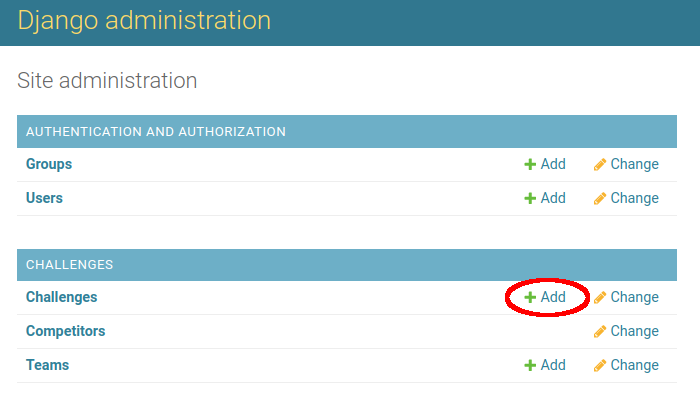
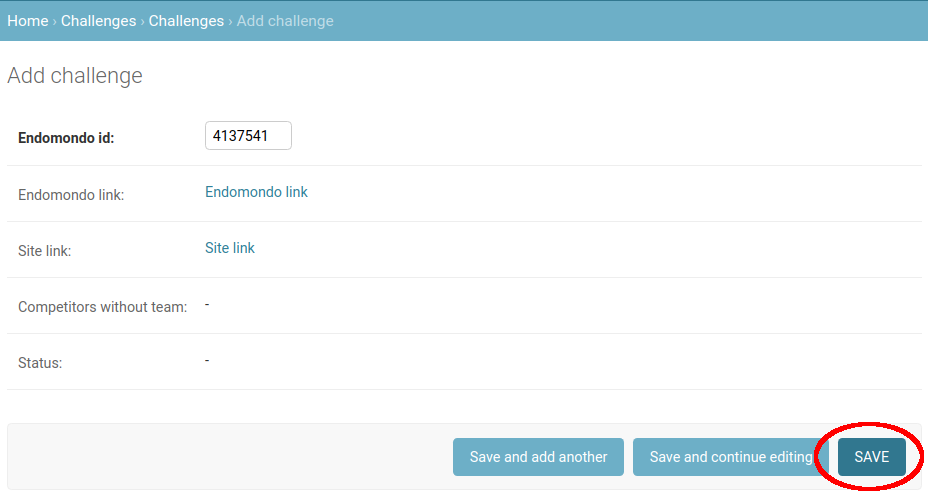
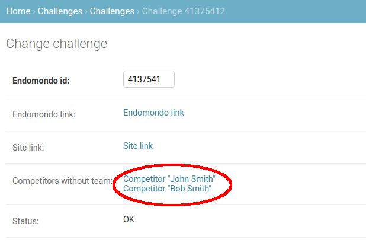
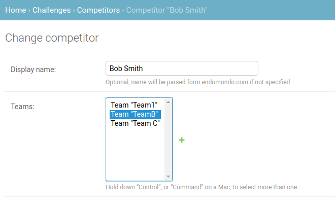
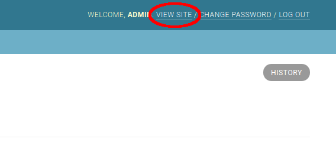

# Admin Guide

1. Create new challenge on [endomondo.com](https://endomondo.com).
2. Invite the Endomondo (bot) user to the challenge on endomondo.com
3. Invite people to the challenge on endomondo.com
4. Copy the ID of the challenge from the end of the URL, eg.:

5. Go to `<endomondo app>/admin/` (login required with an admin user)
6. Click **Add Challenge**

7. Paste the copied ID to the "Endomondo id" field
8. Click **Save**

9. Create all teams similar way - select the new challenge from the drop-down for each team

10. Wait 15 minutes for the challenge to be loaded from Endomondo

11. Select the challenge in the admin. Each competitor who does not have a team yet will be listed.

12. Open each competitor on a new tab.

13. Select the competitor's team in the list and click **Save**

> :warning: **Always Use CTRL+click to select teams! Each (multiple) teams must be selected if the user participated in a challenge before. Otherwise the user would be deleted from the old challenge!** :warning:

14. Close the tab and continue with the next competitor

15. Click **VIEW SITE** in the top right corner to go to the public site and check the results.

## Notes

* After a challenge finished, it will be updated for one more day. After that it will not update anymore.
